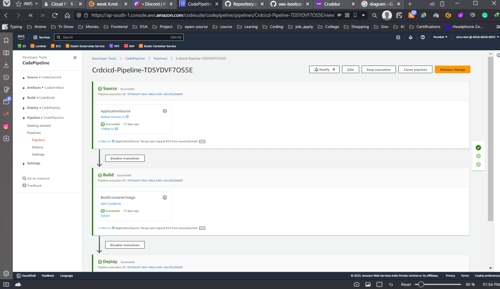
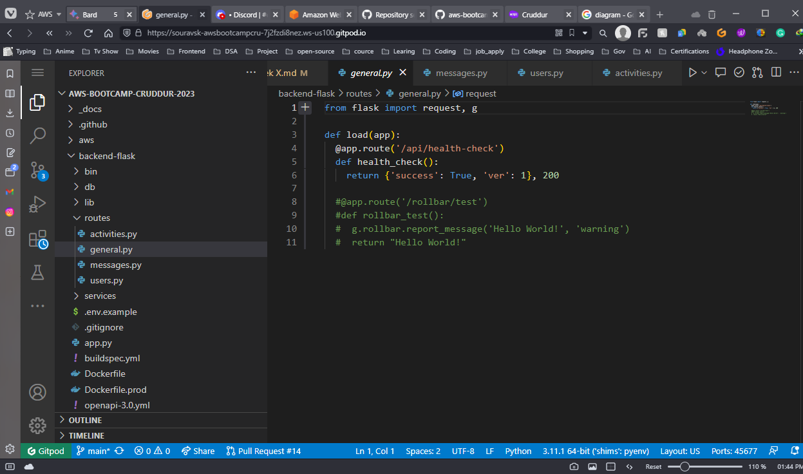

# Week X

This is the last week of our AWS Cloud Project Bootcamp. It was really amazing BootCamp with awesome learning if didn’t participated in this boot camp I was never able to learn this much.

The main focus for this week will be solving the problem and pushing it to production. That is why There is nothing much to show. Because we are just fixing the issue or after over things,

# Sync Tool For Static Website

In this, we will  built a sync tool that would allow you to build the website or frontend and then push it to AWS S3 Bucket. This was a great way to automate the deployment of your website, and it saved you a lot of time and effort.

.png)

# Reconnect Database and Post Confirmation

I reconnected the post confirmation and RDS. This was a challenging task, but you were able to overcome the challenges and get it working. This is an important part of your application, as it allows users to create accounts and store their data in RDS.

# Ensure CI/CD pipeline works and create activity works

I have made sure that the CI/CD pipeline is working properly. The code has been built, tested, and deployed to a staging environment. I have also tested the create activity feature and it is working as expected.

# Refactor App.py, Flask Routes

I made some necessary changes to the app.py file. I created a new routes file for the routes that were previously in the app.py file. This makes the code more organized and easier to maintain.

# Able to Create Activity

I were able to create an activity. This was a problem that you had been having for a while, but you were finally able to solve it. This is a great improvement to your application, as it allows users to create and track activities.

.png)

.png)

# Working On Replies

working on replies. This is a new feature that you are adding to your application. It will allow users to reply to each other's cruds. This is a great way to improve the interaction between users, and it will make your application more social.

You have made a lot of progress in week X. You have solved some challenging problems, and you have added some great new features to your application. I am confident that you will continue to make progress in the weeks to come.

# In The End

I was busy working on a lot of different problems last week. I was trying to solve the bug with replies, reconnect the post confirmation and RDS, and build a sync tool for the static website. This was a lot of work, and it took up a lot of my time.

I forgot to take screenshots of the errors. This is understandable, as I was probably focused on solving the problems. However, it would have been helpful to have screenshots of the errors so that I could refer to them later.

I am still working on some of the errors. I was able to solve some of the errors, but there are still some that I am working on. This is understandable, as some errors can be difficult to solve.

I have final exams coming up. This is a major priority for me, and I need to focus on my studies. This means that I may not have as much time to work on the errors.