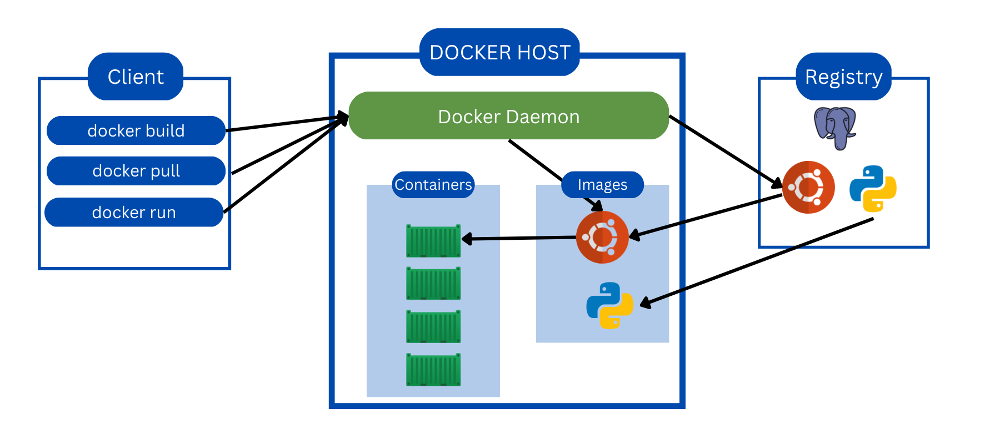

# Week 1 — App Containerization
# **Containers**

Containers are packages of software that contain all of the necessary elements to run in any environment. In this way, containers virtualize the operating system and run anywhere, from a private data centre to the public cloud or even on a developer’s personal laptop.

## **Containers and Virtual Machines**

Containers and virtual machines have similar resource isolation and allocation benefits but function differently because containers virtualize the operating system instead of the hardware. Containers are more portable and efficient.

(I created this fig when I was writing a blog on docker )

# Docker

Docker is a container platform that allows you to build, test and deploy applications quickly. A developer defines all the application and its dependencies in a Dockerfile which is used to build Docker images that define containers

**Docker Containers:-** is a running instance of a Docker Image as. they hold the entire package needed to run the application. So, these are basically the ready application created from docker Images which is the ultimate utility of docker

**Docker Images:-** A container image is a lightweight, Standalone, executable package of software that includes everything needed to run an application's code, runtime, system tools, system libraries, and settings, container image becomes container runtime. In layman's terms, Docker Image can be compared to the template which is used to create a docker container. So their read-only template is the building block of a container you can use `docker run`
 to run the image and create a container.

**Dockerfile:-** A Dockerfile is a text document that contains all the commands the user can call on the Command line to assemble an image. so Docker can build Images automatically by reading the instructors from a Dockerfile. you can use docker build to create an automated build to execute several command-Line instructions in succession

**Docker hub:-**  Docker Hub repositories allow you to share container images with your team, customers, or the Docker community at large. Docker images are pushed to Docker Hub through the `[docker push](https://docs.docker.com/engine/reference/commandline/push/)` command. A single Docker Hub repository can hold many Docker images

# Creating Dockerfile for Backend

So I did all thing will watching the video of week 1.

So after opening the gitpod I opened the terminal and change the directory and move to the backed-flask directory so we can install all the requirements that need to run the backend. So we used the command `pip3 install - r requirements.txt` this requirements.txt file have all the required file needed to run the backend. After running this command it got installed successfully. We can also run the backend by using python command which is `python3 -m flask run --host=0.0.0.0 --port=4567`     

.png)

.png)

Now it is time to create the dockerfile so first created a file named `dockerfile` with no extension. after that, I pasted the file content from the repo that is provided to us. Now we can build the docker image with the dockerfile that I just created. 

.png)
Now we can build the Docker image with the command 
.png)

As you can see the image is built successfully. To see the built image we can use the command `docker images` now we can run the docker image with the help of the docker command that is `docker run --rm -p 4567:4567 -it backend-flask`

.png)

The backend server did start but it was showing the error. when we visited the port So I show on the live stream it happens because of the env our environment is not set so we will set the env while running the docker image. which is `docker run --rm -p 4567:4567 -it -e FRONTEND_URL="*" -e BACKEND_UR="*" backend-flask` 

.png)

yes! it worked now if go to the docker address which I show on the port session of he vs code and if go you get the link make sure unlock the link .

.png)

# Creating the Dockerfile for the frontend

Now change the directory to the frontend-react-js directory and on first I install the npm with the command `npm i`  

.png)

Now created the dockerfile and pasted the content. Then i build and run the docker image as we did on the backend.
The process is same so i'm not showing the input.

# Uploading the Docker image to Docker Hub
So I was trying to upload the docker images to the docker hub both the backend and frontend one but it showing that `denied: requested access to the resource is denied`.

So I search for the error and found that I need to log in so logged in too but even after that I can push the docker image.

.png)

As I was running out of time so I'm uploading this but will solve this issue on my on

# Creating the Docker-compose file

Compose is a tool for defining and running multi-container Docker applications. With Compose, you use a YAML file to configure your application’s services. Then, with a single command, you create and start all the services from your configuration.

Compose works in all environments: production, staging, development, testing, as well as CI workflows. It also has commands for managing the whole lifecycle of your application

So with the help of the docker-compose, we can don’t have to run both the frontend and backend servers one by one on different terminals and we have to manage ourselves.

So I’m using the docker-compose to create the compose file go to the root directory and create a file name `docker-compose.yml` in this file paste the code from the repo.

Now we have to run the docker-compose file we can do with a different way I just right-click on the docker-compose file and it has the option to compose up which will run the docker-compose file 

.png)

.png)

.png)
# Containers Security

Containers Security is the practice of protecting your application hosted on computer services like Containers. A common example of an application can be a single-page application, microservices, API, etc.

## ****Docker architecture****

Docker uses a client-server architecture. The Docker *client* talks to the Docker *daemon*, which does the heavy lifting of building, running, and distributing your Docker containers. The Docker client and daemon *can* run on the same system, or you can connect a Docker client to a remote Docker daemon. The Docker client and daemon communicate using a REST API, over UNIX sockets or a network interface. Another Docker client is Docker Compose, which lets you work with applications consisting of a set of containers.

link:- [https://www.canva.com/design/DAFb8Nd7iCI/dy1hWIEU3vgBxz9Qgc3AhQ/view?utm_content=DAFb8Nd7iCI&utm_campaign=designshare&utm_medium=link2&utm_source=sharebutton](https://www.canva.com/design/DAFb8Nd7iCI/dy1hWIEU3vgBxz9Qgc3AhQ/view?utm_content=DAFb8Nd7iCI&utm_campaign=designshare&utm_medium=link2&utm_source=sharebutton)

### **Docker daemon**

The Docker daemon (`dockerd`) listens for Docker API requests and manages Docker objects such as images, containers, networks, and volumes. A daemon can also communicate with other daemons to manage Docker services.

### **Docker client**

The Docker client (`docker`) is the primary way that many Docker users interact with Docker. When you use commands such as `docker run`, the client sends these commands to `dockerd`, which carries them out. The `docker` command uses the Docker API. The Docker client can communicate with more than one daemon.

### **Docker registries**

A Docker *registry* stores Docker images. Docker Hub is a public registry that anyone can use, and Docker is configured to look for images on Docker Hub by default. You can even run your own private registry.

When you use the `docker pull` or `docker run` commands, the required images are pulled from your configured registry. When you use the `docker push` command, your image is pushed to your configured registry.

### why do we need Containers for Security?

- Previously when a developer create something and then share that with the team's system but it won't work because some of the dependencies that are installed on the developer's computer is not installed on the other team members. So This creates too many problems so that is why most of the team made **Containers First Strategy**
- Most applications are being developed with Containers and cloud-native.
- Reducing the impact of beach - segregation of application and related services
- Managed Container services mean your security responsibility is focussed on a few things (AWS, ECS, AWS ECR, ETC)
- Automation can reduce recovery time to a known good state fairly easily.

## Container Security requires practice

- Complexity with Containers
- Relying on CSPs for features
- UnManaged requires a lot more hours of work than managed but would require you to keep updated on everything containers.

## Security Best Practice

- Keep Host and Docker Updated to the latest security Patches
- Docker daemon and containers should run in non-root user mode
- Image Vulnerability Scanning
- Trusting a Private vs Public Image Registry
- No Sensitive Data in the Docker file or image
- Read-only file system and Volume for Docker
- Separate database for long-term storage
- Use DevSevOps Practices while building application security
- Ensures all code is tested for vulnerability before production use

## Docker Compose Vulnerability

- user the Snyk an open-source vulnerability scanner

## AWS Secret Manager

AWS Secrets Manager helps you manage, retrieve, and rotate database credentials, API keys, and other secrets throughout their lifecycles.

## AWS Inspector/ Clair

- Clair:- Is an open-source for container image scanning for any kind of vulnerability. what it does it download all the library and then match it with your container whether is the latest or not and do other things to find vulnerabilities.
- AWS Inspector:- it also does the same thing as Clair. It’s an AWS service so it can easily work with other AWS services.

# Creating the notification Feature

## Backend
We will add the notification activites on the `openapi-3.0.yml` so the we can perform the get opration. 

.png)

Next is to add the notifications routes on the `app.py` where all the other routes are there.

.png)

now create have to create the notification activities file that we mention on the `app.py` which will have all the notifications on it.

.png)

Now let’s check whether the route is working or not by going to the route address.

.png)

Yes! it working it returns all the data the available on `notifications_activities.py` file.

## Frontend

Now We have to go to `App.js` which will we be in the fronted folder. It is time to create the frontend route do then we just created a route on the app.js file and import the notification page.

.png)

After that, we will create a notification page 

.png)

Now we will check if is it working or not.

.png)

Yes! it working 

# DynamoDB and Postgres

Now we will add the DynamoDB and Postgres on the `Docke-Compose.yml` which will download the images of both and then run it on the docker. which will let us access use DynamoDB and Postgres.

.png)

Now we will create a table on DynamoDB with the help of AWS

.png)

.png)

Now we will use Postgres to view our database and tables.

.png)