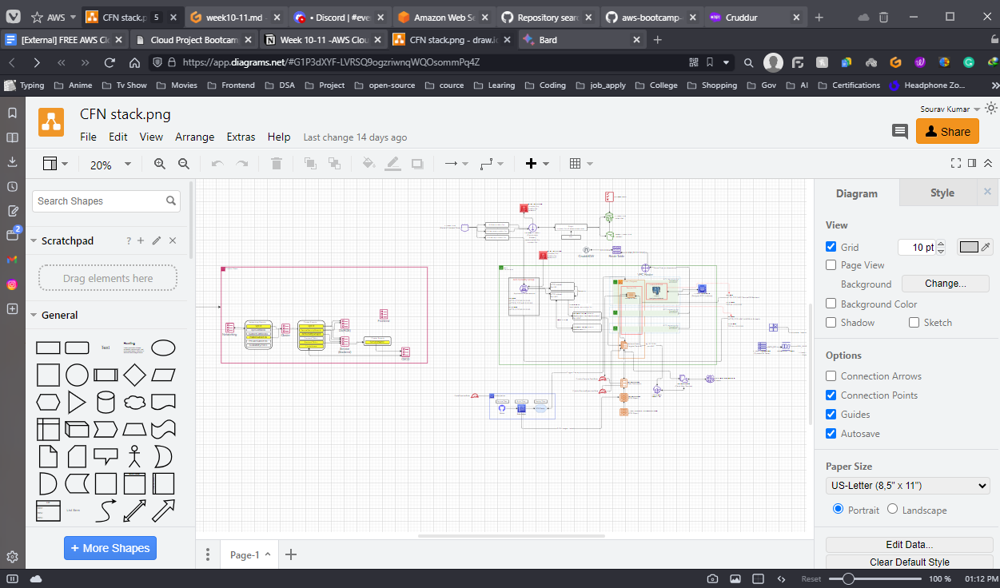

# Week 10-11 - AWS CloudFormation Or CFN (Iac)

# AWS CloudFormation

AWS CloudFormation is a service that helps you model and set up your AWS resources so that you can spend less time managing those resources and more time focusing on your applications that run in AWS. You create a template that describes all the AWS resources that you want (like Amazon EC2 instances or Amazon RDS DB instances), and CloudFormation takes care of provisioning and configuring those resources for you. You don't need to individually create and configure AWS resources and figure out what's dependent on what; CloudFormation handles that.

## Benefits of CFN

- **Simplify infrastructure management**
- **Quickly replicate your infrastructure**
- **Easily control and track changes to your infrastructure**

This week fully focuses on infrastructure as code (Iac) and for that, we will use the AWS CloudFromation.

Let’s Create a sample to show we can create an EC2 instance with CFN

**Step 1:-** First created a template for EC2 and a deployment script. 

**Step 2:-** Deploy the template.

.png)

**Step 3:-** Now let’s go to the CFN page and let see if the stack is created or not.

.png)

Step 4:- Now that is created we have to review it and give the permission to execute.

.png)
Step 5:- Now it is executed.

.png)

.png)

# CFN for Networking Layer

First, we will start with the networking we will create a template for all the networking-related configurations.

The base networking components for our stack: - VPC - sets DNS hostnames for EC2 instances - Only IPV4, and IPV6 are disabled - InternetGateway - Route Table - route to the IGW - route to Local - 6 Subnets Explicity Associated to Route Table - 3 Public Subnets numbered 1 to 3 - 3 Private Subnets numbered 1 to 3

Let’s create the template file with all the requirements that we need and then deploy it.

.png)

Let’s does the stack is created or not.

.png)

If we click on the stack we have a different main and we can click on then see their related information. Like in **Event,** we can see that operation is going on.

.png)

In the **Resou**r**ces** section, we can see what are the resource is being created with this stack.

.png)

In the **Output** Section, we can see the service in key values in which the key has the service name given by us and in the value we have the value that is created. For example, if we create a VPC the name cloud be “NewVPC” which is the key and the Valuse will be the VPC number.

.png)

Now the networking is ready.

# CFN for Cluster Layer

The networking and cluster configuration to support fargate containers - ECS Fargate Cluster - Application Load Balancer (ALB) - ipv4 only - internet facing - certificate attached from Amazon Certification Manager (ACM) - ALB Security Group - HTTPS Listener - send the naked domain to frontend Target Group - send api. subdomain to backend Target Group - HTTP Listener - redirects to HTTPS Listener - Backend Target Group - Frontend Target Group

So these are things that cluster stack is doing we will do the same step that we have to do so far to achieve this like write the template file and deploy that file.

.png)

.png)

Let’s all of them have been created or not.

A load Balancer (ALB) is created

.png)

ALB Security Group is created

.png)

Target Group is created for Fronted and backend

.png)

# CFN for RDS Layer

Now the networking and cluster are set and ready it is time to create the Postgres Database from AWS RDS.

The primary Postgres RDS Database for the application - RDS Instance - Database Security Group - DBSubnetGroup

We will do that same step like writing the template file, deploying it and then executing the changes with CFN after that is been done successfully we can go and check if the RDS instance is running or not.

.png)

Yes, it is running . I will delete the old instance after everything will run.

# CFN for Service Layer

Now it’s time to create the service layer or we can say the backend layer where it will create ECS and run on it.

Task Definition Fargate Service Execution Role Task Role

After writing the template and deploying it let's see if it is running or not and if it is healthy.

> It took much more time than I was thinking. I have to delete all those stacks twice to make it work and I forgot the count of how many times I deleted the backed services itself. But at last, it worked took many days.

Let see the AWS Elastic Container Service (ECS)

.png)

Good it is healthy

Let’s see the container or task

.png)

Good it is healthy 

Now Let’s check the it working or not .

.png)

Yes it is working.

# CFN for DynamoDB Layer

Now time for DynaomoDB

The same step that we have been doing for so long.

.png)

it is created. Let’s check 

.png)

# CFN for CI/CD Layer

Now for the CI/CD layer

.png)

.png)

The old code pipeline will be deleted.

# CFN for website Hosting Layer

For the last one the website page itself. 

CloudFront Distribution - S3 Bucket for www. - S3 Bucket for naked domain - Bucket Policy

This is the thing that our Fronted layer does.

.png)

.png)

Let’s go to cruddur.fun

.png)

YES, it is working.(RDS is off that’s why it is not showing any data)

# CFN Diagram

It looks like Lucd-chat was asking for payment, so I found a free program to draw the CFN Diagram using Google Drive. The website is draw.io. To show that the diagram was created by me, I have added the screenshot.

Link:- https://drive.google.com/file/d/1P3dXYF-LVRSQ9ogzriwnqWQOsommPq4Z/view?usp=sharing

