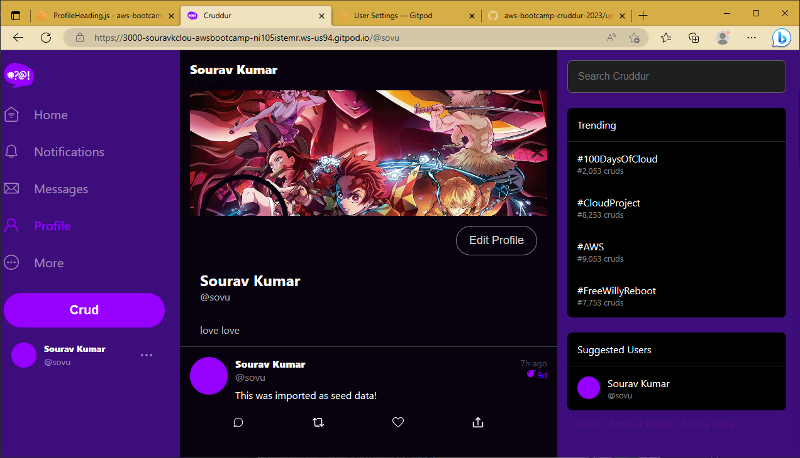

# Week 8 - Serverless Image Processing

# What we are doing this week

 So this week we are working on the user profile page till now the user profile page is not working we will work on that. So the most important part of this week will be that we have to process the image that the user will upload for its avatar or profile pic. 

Why we are processing the image?

Because if we don’t then we will have big side images stored on our S3 bucket. So we have to process that image so that it gets into the required size only.

So we will first look into some Doc to understand some AWS feature that we are going to use.

# AWS CDK

The AWS CDK lets you build reliable, scalable, cost-effective applications in the cloud with the considerable expressive power of a programming language. This approach yields many benefits, including:

- Build with high-level constructs that automatically provide sensible, secure defaults for your AWS resources, defining more infrastructure with less code.
- Use programming idioms like parameters, conditionals, loops, composition, and inheritance to model your system design from building blocks provided by AWS and others.
- Put your infrastructure, application code, and configuration all in one place, ensuring that at every milestone you have a complete, cloud-deployable system.
- Employ software engineering practices such as code reviews, unit tests, and source control to make your infrastructure more robust.
- Connect your AWS resources together (even across stacks) and grant permissions using simple, intent-oriented APIs.
- Import existing AWS CloudFormation templates to give your resources a CDK API.
- Use the power of AWS CloudFormation to perform infrastructure deployments predictably and repeatedly, with rollback on error.
- Easily share infrastructure design patterns among teams within your organization or even with the public.

The AWS CDK supports TypeScript, JavaScript, Python, Java, C#/.Net, and Go. Developers can use one of these supported programming languages to define reusable cloud components known as [Constructs](https://docs.aws.amazon.com/cdk/v2/guide/constructs.html). You compose these together into [Stacks](https://docs.aws.amazon.com/cdk/v2/guide/stacks.html) and [Apps](https://docs.aws.amazon.com/cdk/v2/guide/apps.html).

.png)

# AWS CloudFormation

AWS CloudFormation enables you to create and provision AWS infrastructure deployments predictably and repeatedly. It helps you leverage AWS products such as Amazon EC2, Amazon Elastic Block Store, Amazon SNS, Elastic Load Balancing, and Auto Scaling to build highly reliable, highly scalable, cost-effective applications in the cloud without worrying about creating and configuring the underlying AWS infrastructure. AWS CloudFormation enables you to use a template file to create and delete a collection of resources together as a single unit (a stack).

AWS CloudFormation is a service that helps you model and set up your AWS resources so that you can spend less time managing those resources and more time focusing on your applications that run in AWS. You create a template that describes all the AWS resources that you want (like Amazon EC2 instances or Amazon RDS DB instances), and CloudFormation takes care of provisioning and configuring those resources for you. You don't need to individually create and configure AWS resources and figure out what's dependent on what; CloudFormation handles that. The following scenarios demonstrate how CloudFormation can help.

# AWS SAM vs CDK

## What is SAM?

The AWS Serverless Application Model (AWS SAM) is a toolkit that improves the developer experience of building and running serverless applications on AWS. AWS SAM consists of two primary parts:

1. **AWS SAM template specification** – An open-source framework that you can use to define your serverless application infrastructure on AWS.
2. **AWS SAM command line interface (AWS SAM CLI)** – A command line tool that you can use with AWS SAM templates and supported third-party integrations to build and run your serverless applications.

## AWS CDK

You can use the AWS SAM CLI to locally test and build serverless applications defined using the AWS Cloud Development Kit (AWS CDK). Because the AWS SAM CLI works within the AWS CDK project structure, you can still use the [AWS CDK Toolkit](https://docs.aws.amazon.com/cdk/latest/guide/cli.html) for creating, modifying, and deploying your AWS CDK applications.

# Task -1 (Serverless Image Process CDK)

we wrote the code for creating an s3 bucket which will be deployed using CDK. First, we will check is the code is working file to deploy or not and to do that we have a command that is `cdk synth` if there is any error it will show as.

.png)
Then we are creating stack on the cloud foundation

.png)

Now we can those stack that we have created 

.png)

Now its is time to deploy the code which will create the s3 bucket

.png)

As we can see that we have deploy it successfully

.png)

Now we will add one more function that will create a lambda function and connect the s3 bucket with that lambda.

.png)

As you can see it is created

.png)

# Task - 2 (Serving Avatars via CloudFront)

## AWS CloudFront

Amazon CloudFront is a web service that speeds up distribution of your static and dynamic web content, such as .html, .css, .js, and image files, to your users. CloudFront delivers your content through a worldwide network of data centers called edge locations. When a user requests content that you're serving with CloudFront, the request is routed to the edge location that provides the lowest latency (time delay), so that content is delivered with the best possible performance.

- If the content is already in the edge location with the lowest latency, CloudFront delivers it immediately.
- If the content is not in that edge location, CloudFront retrieves it from an origin that you've defined—such as an Amazon S3 bucket, a MediaPackage channel, or an HTTP server (for example, a web server) that you have identified as the source for the definitive version of your content.

.png)

### CDN

A content delivery network (CDN) is a network of interconnected servers that speeds up webpage loading for data-heavy applications. CDN can stand for content delivery network or content distribution network. When a user visits a website, data from that website's server has to travel across the internet to reach the user's computer. If the user is located far from that server, it will take a long time to load a large file, such as a video or website image. Instead, the website content is stored on CDN servers geographically closer to the users and reaches their computers much faster.

Now if we remember we have deployed a lambda function and what that lambda function does so that lambda function tacks the image and processes the image into the required size. 

we have already deployed the function now it’s time to upload the image and see it.

To do so we have to first write some bash scripts because as we all know it not going to work on just the first try so bash scripts are very helpful full we have to repeat those steps again and again.

.png)

So after so many trial and error we finally upload and process the image

.png)

This is the bucket that is connected with the lambda function.

.png)

# Task - 3 (Users Profile Page)

Here we are now going to create the profile page for the users. and upload the user's image or avatar and banner image.

In those, we are just writing code for the profile page.

.png)

Here is what it looks like. For some reason, it is showing some error which I’m working on. 

Now we have to work on the edit button which will be where we can change the avatar and name and added a bio.

# Task - 4 (Migrations Backend Endpoint and Profile Form)

Now we have to store those bios on the database In our preview task we have created all the frontend parts now it is time to connect those parts to the backend.

First, we have created a new table name `public. user` 

.png)

Then we will create a bash script that will migrate and rollback table of the bio 

.png)

.png)

.png)

# Task - 5 (Avatar Uploading)

In this task, we will implement client-side javascript upload for S3.

So we have to finish the thumping pipeline. To do that we have to set up a CloudFront function or lambda function. 

## AWS API Gateway

Amazon API Gateway is an AWS service for creating, publishing, maintaining, monitoring, and securing REST, HTTP, and WebSocket APIs at any scale. API developers can create APIs that access AWS or other web services, as well as data stored in the [AWS Cloud](https://aws.amazon.com/what-is-cloud-computing/). As an API Gateway API developer, you can create APIs for use in your own client applications. Or you can make your APIs available to third-party app developers. For more information, see [Who uses API Gateway?](https://docs.aws.amazon.com/apigateway/latest/developerguide/api-gateway-overview-developer-experience.html#apigateway-who-uses-api-gateway).

API Gateway creates RESTful APIs that:

- Are HTTP-based.
- Enable stateless client-server communication.
- Implement standard HTTP methods such as GET, POST, PUT, PATCH, and DELETE.

### HPPT API

REST APIs and HTTP APIs are both RESTful API products. REST APIs support more features than HTTP APIs, while HTTP APIs are designed with minimal features so that they can be offered at a lower price. For more information, see [Choosing between REST APIs and HTTP APIs](https://docs.aws.amazon.com/apigateway/latest/developerguide/http-api-vs-rest.html).

You can use HTTP APIs to send requests to AWS Lambda functions or to any routable HTTP endpoint. For example, you can create an HTTP API that integrates with a Lambda function on the backend. When a client calls your API, API Gateway sends the request to the Lambda function and returns the function's response to the client.

HTTP APIs support [OpenID Connect](https://openid.net/connect/) and [OAuth 2.0](https://oauth.net/2/) authorization. They come with built-in support for cross-origin resource sharing (CORS) and automatic deployments.

So to upload the avatar we have to have a pre-signed URL where the image will be stored but we can not directly put the URL on the code so what we will do we will create an AWS API gateway to do so.

Create the CloudFront

.png)

Then we created a new route for that

.png)

Now we have to create a new bucket to store those images

.png)

.png)

Now we will check whether the URL is stored or not.

.png)

# Task - 6 (Fixing CORS )

## CORS

Cross-Origin Resource Sharing (CORS) is a protocol that enables scripts running on a browser client to interact with resources from a different origin. This is useful because, thanks to the [same-origin policy](https://developer.mozilla.org/en-US/docs/Web/Security/Same-origin_policy) followed by `XMLHttpRequest` and `fetch` , JavaScript can only make calls to URLs that live on the same origin as the location where the script is running. For example, if a JavaScript app wishes to make an AJAX call to an API running on a different domain, it would be blocked from doing so thanks to the same-origin policy.

## Why Is It Needed?

Most of the time, a script running in the user's browser would only ever need to access resources on the same origin (think about API calls to the same backend that served the JavaScript code in the first place). So the fact that JavaScript can't normally access resources on other origins is a good thing for security.

In this context, "other origins" means the URL being accessed differs from the location that the JavaScript is running from, by having:

- a different scheme (HTTP or HTTPS)
- a different domain
- a different port

However, there are legitimate scenarios where cross-origin access is desirable or even necessary. For example, if you're running a React SPA that makes calls to an API backend running on a different domain. [Web fonts also rely on CORS to work](https://www.w3.org/TR/css-fonts-3/#font-fetching-requirements).

.png)

After so many error it worked finaly

# Summary

This week was really head for me not because of this topic but because of the many other problems the first problem and problem of creation is gitpod. I excited credit limit of gitpod for this month the only option is left for me is to create a new GitHub account with a different email Id so that I can create the new gitpod ID.

This is the problem getting big first I have to set the Environment variable of AWS which took so much time and even after setting things up every time I run something there is some error.

There is still some error that is not solved I think they will get solved when I use my old gitpod account when the credit will be renewed next month until that I have to ignore those error.
